# 특화 프로젝트 매장의 민족

### QR코드를 활용한 웹 키오스크 서비스

<br />

## 매장의 민족 영상 및 소개

- [홍보용 UCC 링크](https://youtu.be/RTmJTcex7Qg)

## 기획 배경

- 많은 소비자가 키오스크 or POS기로 함께 주문하는 것을 불편해 함

  - 키오스크로 주문하는 경우 뒷사람의 눈치가 보임.

  - 테이블 키오스크의 경우 멀리 위치한 사람은 불편함.

- 간편 결제에 절대적 의지

  - 단일 서비스에 대한 의존도가 높음.

  - 시스템 장애

  - 높은 수수료

### 프로젝트 기간 - 2023.08.21 ~ 2023.10.06

## 서비스 화면 소개

### 메인 화면

1. 회원가입

> 

<br/><br/> 2. 장바구니

> 

<br/><br/> 3. 간편페이 등록

> 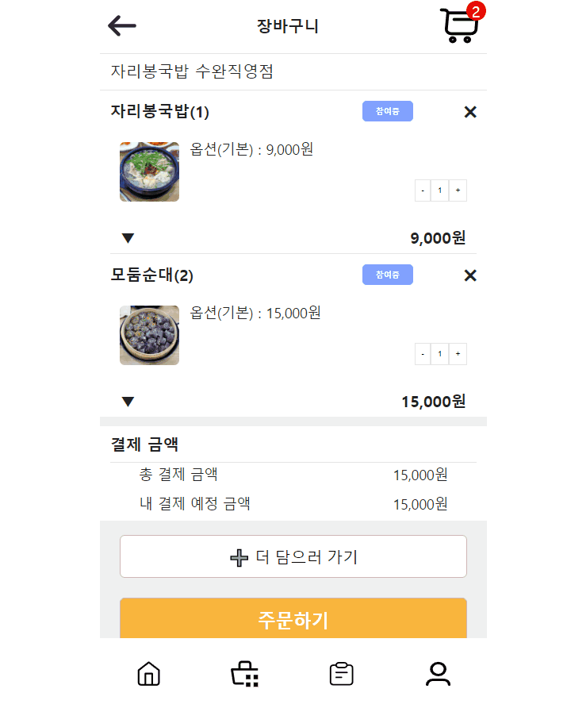

<br/><br/> 4. 결제

> 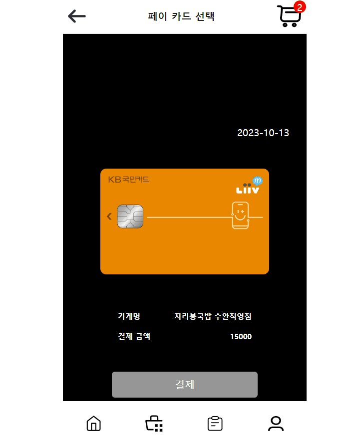

<br/><br/> 5. 마이페이지

> 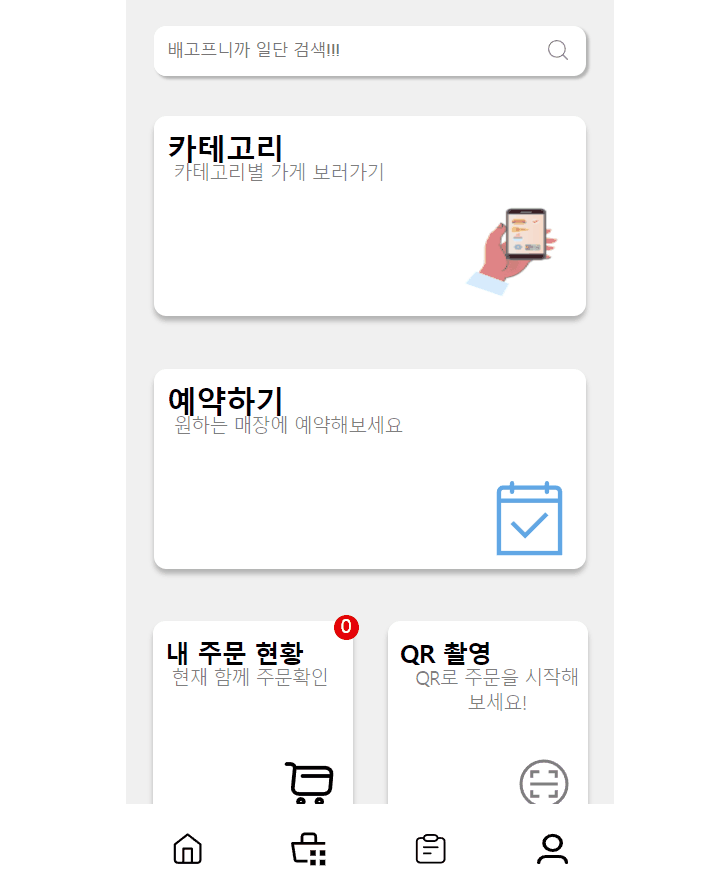

<br/><br/> 6. 로그인 : 로그인 시 JWT 토큰(Access, Refresh) 반환

> 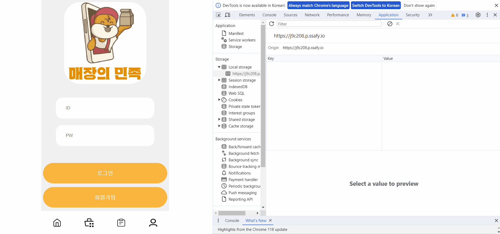

<br/><br/> 7. QR로 해당 가게 접속

> 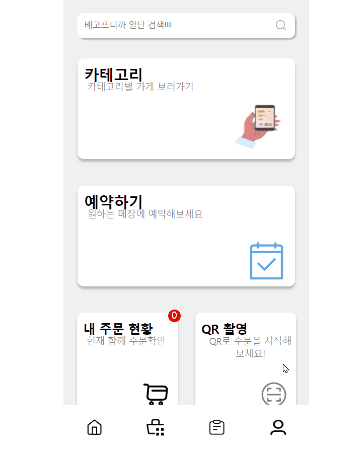

<br/><br/> 8. 사장님 페이지

> 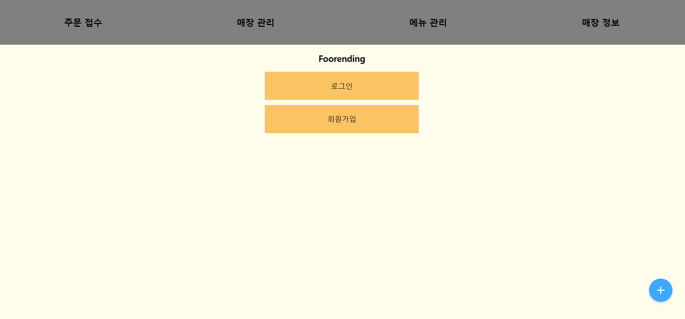

<br/><br/> 9. 주문 알림 : 사용자가 결제 완료 시 해당 가게로 주문 알림 기능

> 

## 주요 기능

- 서비스 설명 : 매장에서의 주문과 결제
- 주요 기능 :
  - 일반 고객과 사장님 2가지 서비스 제공
  - 자체적인 페이 결제시스템 구축
  - SSE 를 통해 고객이 결제 및 주문 완료 시에 사장님에게 주문 알림 기능
  - 결제 시스템 로직에서 암호화 기술 (RSA 적용)
  - MSA Architecture 로 user, store, pay, payment 각각의 서비스 독립적으로 배포
  - JWT (access, refresh token) 을 통한 로그인 인증, 인가 관리

### 🖥️ 개발 환경

---

🖱 **Backend**

- openjdk:11
  - 11.0.20+8 Azul Zulu: 11.66.15
- Spring Boot v2.7.14
- MariaDB v10.5.21
- Redis
- Spring Data JPA
- SSE
- MSA Architecture
- Spring Cloud, APIgateway, Eureka
- Naver SMS
- Kakao Pay API

🖱 **Frontend**

- React.js v18.2.0
- Typescript
- PWA
- Redux v8.1.1
- reduxjs-toolkit v1.9.5
- Styled-Component v6.0.5
- node v16.20.1
- Kakao Map API
- Kakao Pay API

🖱 **IDE**

- IntelliJ v2023.1.3
- VSCode
- HeidiSQL

🖱 **Infra**

- AWS EC2
- Docker v24.0.5
- Nginx
- Jenkins
- Gerrit

### 서비스 아키텍처

---


### 게임 기대효과

---

- **주문 및 결제의 편리함**
  : 핸드폰 QR을 통한 주문
  : 매장의 기기에 의존하지 않고, QR을 통해 개인 핸드폰 기기로 주문!
- **사장님의 비용 감소**
  : 인건비 및 키오스크 렌탈 비용을 줄일 수 있다
- **우리만의 결제시스템 구축**
  : 기존 페이 서비스에 의존하지 않고, 자체적인 페이 서비스 개발

### 기술 특이점

---

- **MSA** Architecture

  - Eureka, API gateway, OpenFeign 등을 통해 MSA 구축
  - user, store, pay, payment 각각의 서비스 및 DB 독립적으로 배포
    > 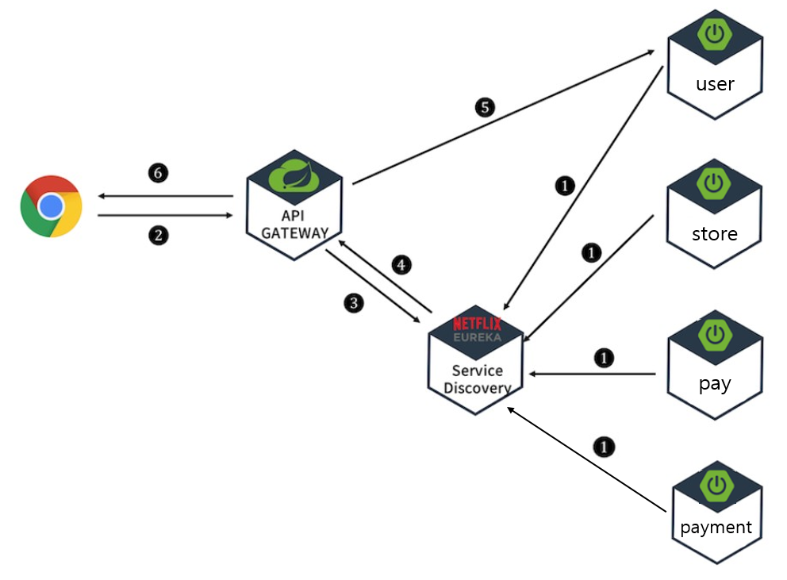

- **JWT** 인증 인가

  - Access token, Refresh token 구현
  - MSA 의 API Gateway의 인증, 인가 기능 구현
  - API Gateway 필터를 통해 JWT 를 검증한 후 서비스 접근에 대한 인가
  - Refresh token(Http Only 쿠키) 을 통한 잦은 로그아웃, 보안 문제 보완

- **자체 결제** 시스템

  - 테크 기업의 간편 결제 로직을 참고하여 구현
  - 결제 인증, 결제 승인 2단계에 거쳐 결제 진행
  - 결제 과정 중 데이터를 검증하여 외부 접근에 의한 위변조 방지

- **보안** 시스템

  - RSA 알고리즘을 이용한 데이터 암호화
    - 카드 정보 등을 암호화하여 서버에 전달 후 복호화하여 카드사 인증에 사용
  - SHA 알고리즘을 이용한 데이터 해싱
    - 사용자 비밀번호 등을 해싱하여 서버에서도 확인할 수 없는 형태로 저장

- **SSE**를 통한 주문요청 알림

  - SSE 를 사용해 주문이 들어온 해당 가게의 사장님에게 알림 기능
  - 클라이언트의 요청 없이도 서버에서 클라이언트로 단방향의 Push Notification 전송

- **redux**-toolkit

  - 프론트엔드 구현시 단계별 컴포넌트 내부에서 session상태를 관리하기 위해서 redux와 redux-toolkit을 이용하여 openvidu를 이용한 게임방 세션에 관한 데이터 상태관리를 전역으로 수행하였고, 진행되는 게임에 대한 정보 또한 컴포넌트가 아닌 game slice를 따로 구성하여 필요한 데이터를 업데이트 및 초기화하였습니다.

- **TypeScript**

  - 기존 자바스크립트 소스와의 호환
  - 정적타입 : 컴파일단계에서 오류를 포착

- **PWA**

  - 모바일 사이트에서 네이티브 앱과 같은 사용자 경험을 제공
  - 사장님 서비스는 웹, 고객 서비스는 모바일로 제공

- Naver SMS

  - Naver SMS API 를 통해 핸드폰 문자 인증 후 회원가입

- Kakao Pay, Map

  - Kakao API 사용

- **Jenkins**

  - user, store, pay, payment, eureka, API-gateway 서비스 각각의 독립적인 배포 자동화
  - 프로젝트 표준 컴파일 환경에서의 컴파일 오류 검출
  - Build 자동화의 확립
  - 자동화 테스트 수행

- **배포** : 배포에 관한 상세 정보는 [여기](/exec/)에 있습니다.

### 👨‍👩‍👧 협업 툴

---

- Git
- Jira
- Figma

  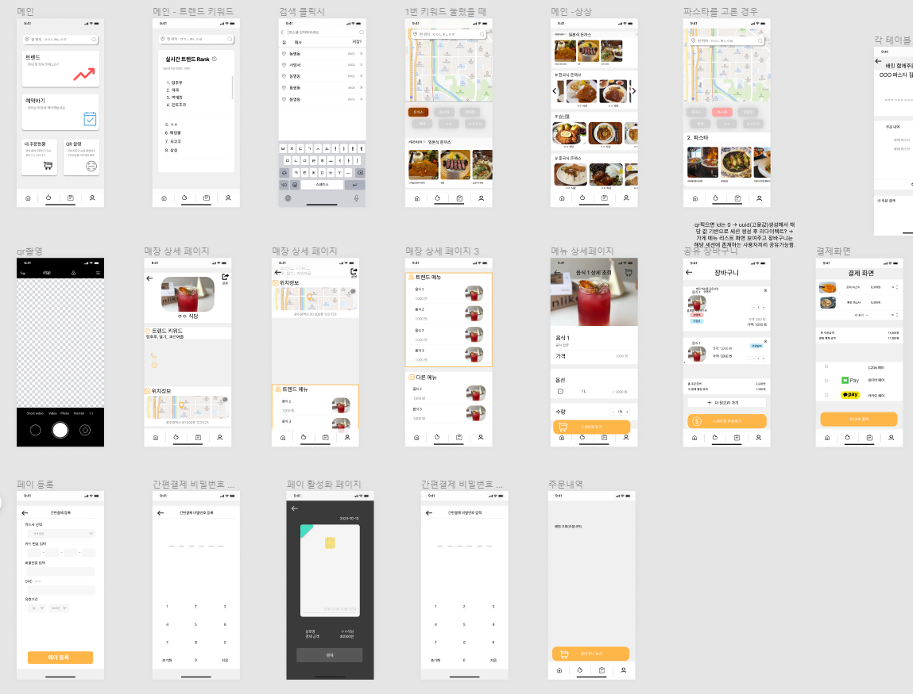

- Notion

  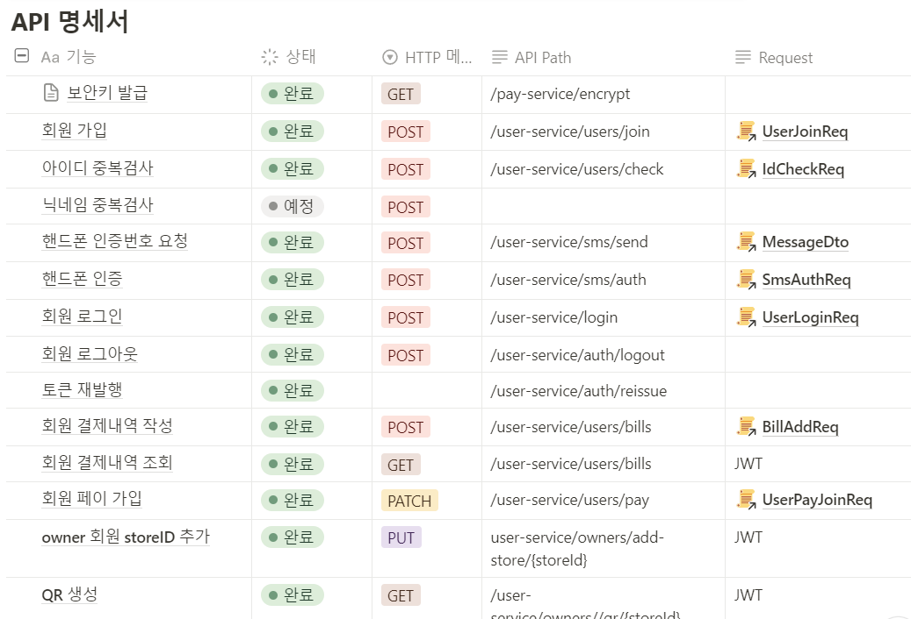

  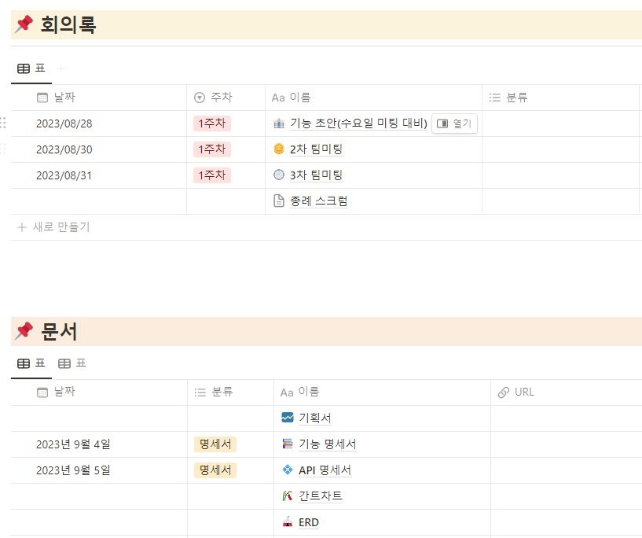

- Mattermost

### 💭 기능 명세서

---

- [기능명세서](/exec/img/기능명세서.pdf)

## ✨컨벤션

### git

```bash
커밋 타입: 내용 자세히 적어주기

→ git commit -m “[BE] Feat : 회원 가입 기능 추가”
```

- 분류

  - FE : 프론트엔드
  - BE : 백엔드
  - CMN : 공통

- 작업 종류
  - Init : 초기화
  - Style : 스타일 수정 (css, UI 변경 등)
  - Feat : 기능 개발
  - Fix : 버그 수정
  - Add : 단순 코드, 주석, 파일 추가
  - Docs : readme 수정과 같은 문서
  - Refactor : 리팩토링(코드, 성능) 각색
  - Remove : 파일 삭제만 수행하는 경우
  - Test : 테스팅 관련
  - Chore : 위에 해당되지 않는 나머지 (기타 등등)
  - Merge : 최신 develop을 pull할 때 충돌을 해결하거나 merge가 된 경우

// 작업내용
[파일명,도메인] - 작업내용*한눈에*알아보게\_적기

// 예시
[FE] Docs : readme.md - 팀원 소개 작성
[BE] Feat : User - 로그인 기능 개발

### 💡 Git Flow 브랜치 전략

---

- Git Flow model을 사용하고, Git 기본 명령어 사용한다.

- Git Flow 사용 브랜치

  - feature - 기능
  - develop - 개발 및 배포 테스트
  - master - 배포

- Git Flow 진행 방식

  1. feature 브랜치가 완성되면 develop 브랜치로 merge request를 통해 merge

     ⇒ merge request가 요청되면, 선정한 리뷰어와 함께 코드 리뷰를 하여 안전하게 merge

  2. 브랜치를 세분화해서 작업함으로써 충돌을 최소화

- feature 브랜치 이름 명명 규칙

  - [FE or BE]\_feature/[기능 이름]

```bash
BE/user-service
FE/customer
```

### Jira

---

프로젝트 진행을 위한 일정 및 업무 관리를 위해 Jira를 이용하였습니다. 매주 월요일 오전 회의를 통해 한 주 동안 진행되어야 할 주 단위의 스프린트 계획을 짜고, 진행할 이슈들을 등록했습니다.

- 에픽(Epic) : 요구사항 정의서의 대분류 기능
- 작업(Task) : 해당 기능에 필요한 상세 기능
- 월요일마다 스프린트 시작
- 그 주에 할일 이슈들로 정리 → 진행중에는 되도록 하나의 태스크만.
- Story - 게임의 흐름단계에 따라 나눔

이 외에, 협업 메신저(Mattermost)에 알람을 등록하여 작업 상황을 실시간으로 확인할 수 있도록 했습니다.

### Notion

---

모두가 봐야할 공지, 함께 공부해야 할 링크 등을 모아두고 찾아보기 쉽게 정리하였습니다. 또한, 모든 회의 및 피드백은 기록으로 남겨두어서 잘 반영할 수 있도록 하였습니다. 컨벤션 규칙, API명세서 등도 노션에 기록하여 모두가 상시 확인할 수 있도록 관리했습니다.

### Scrum

---

매일 아침 9시에 어제 했던 일, 오늘 할 일을 각자 정리해서 5~10분 동안 서로 공유하는 시간을 가졌습니다. Scrum을 통해 팀원들의 현재 상황을 공유하여 프로젝트에 대한 전체적 흐름을 모두가 파악할 수 있었습니다.

### Front-end

- 색상 컬러 코드
- 폰트 종류 및 사이즈
- **변수와 메서드의 네이밍 규칙**
- 줄바꿈, 인덴팅 규칙
- **state, props 순서 및 네이밍?**

### 폴더구조

```
├─public
└─src
├─api
├─assets 이미지, 영상들
├─components - 컴포넌트들
 └─style - 각 컴포넌트에 사용된 styled컴포넌트 저장폴더 / GlobalStyle.js : 전역 css설정해주는 컴포넌트
    │
    └─ pages- 페이지 파일들
    └-
    └- home
    └- …
```

- 컴포넌트의 확장자는 .jsx확장자로 통일 하되 이외의 js파일들은 .js로

- styled-component 쓸때 유의할점 - 함수안에 넣으면 노란색 에러뜸

  [styled-components: Basics](https://styled-components.com/docs/basics#passed-props)

- 컴포넌트 내부 컨벤션

  - 위에서부터 props → redux변수 → state순으로 나열.
  - 함수는 useEffect문 → 이동및 변수변환로직 → api관련 로직

### ✨ ERD

---

> 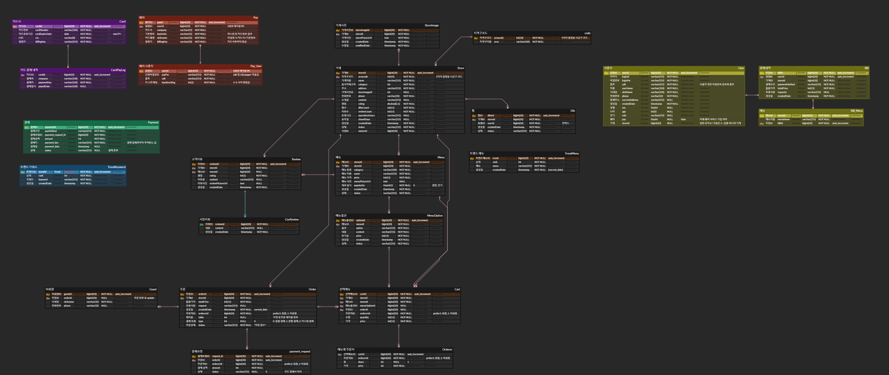

### ✨ EC2 포트 정리

---

| **PORT** |                        **이름**                         |
| :------: | :-----------------------------------------------------: |
|   443    |                          HTTPS                          |
|    80    | HTTP - HTTPS로 리다이렉트(프론트 페이지지로 리다이렉트) |
|   3000   |                    React - customer                     |
|   3001   |                      React - owner                      |
|   3306   |                     MariaDB - user                      |
|   3307   |                      MariaDB - pay                      |
|   3308   |                     MariaDB - card                      |
|   3309   |                    MariaDB - payment                    |
|   3310   |                     MariaDB - store                     |
|   3311   |                     MariaDB - cart                      |
|   6379   |                          Redis                          |
|   8000   |                  ApiGateway - Service                   |
|   8080   |                         Jenkins                         |
|   8761   |                   Discovery - Service                   |
|   9999   |                     Cart - Service                      |

### 😃 팀원 역할

#### 🍎 권영재(FE)

- Redux 설정, 지도 api연동, 슬라이드 구현
- 사장님 프로젝트 총 담당(주문 현황 드래그 앤 드랍 구현)
- 사장 및 고객의 공통적인 로그인 및 회원가입 로직 구현

<br>
    
####  🍈 김대홍(BE)

- API Gateway Filter 를 이용한 회원별 인증, 인가 처리
- Spring Security, JWT를 이용한 로그인, 회원가입(user 서버)
- JWT, Redis를 이용해 Refresh token 관리
- SSE 알림 기능
- 네이버 문자 API 를 통한 회원가입 문자인증
- QR생성 API

<br>

#### 🍊 신관우(INFRA, BE)

- Jenkins 및 docker를 통한 CI/CD 구축
- Gerrit 연동을 통한 코드리뷰 환경 설정
- 주문 로직(store 서버) 개발

<br>

#### 🍋 이승태(FE)

- 로그인,회원가입,매장상세,메뉴상세

<br>

#### 🍉 이현우(FE)

- 장바구니, 카드 등록 및 결제, 간편 비밀번호
- 결제 통신간 암호화

<br>

#### 🍌 전윤철(BE)

- 결제 로직(pay 서버, payment 서버) 개발
- 카카오페이 등 외부 결제 API 연동
- 자체 페이 구현
- 암호화 및 해싱 알고리즘 적용

<br>
